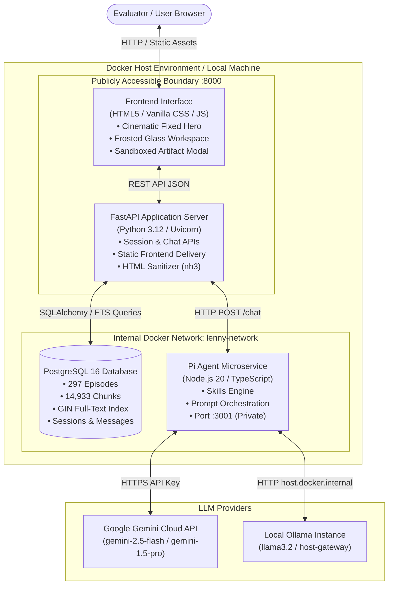
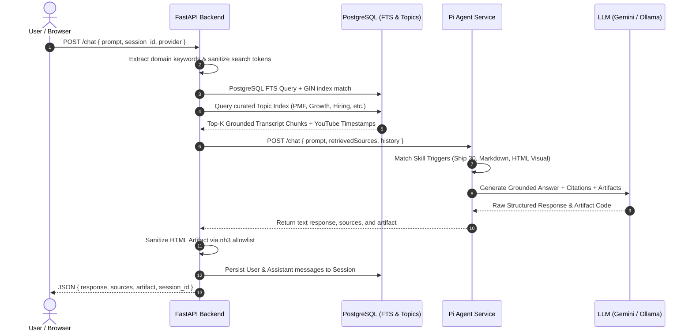
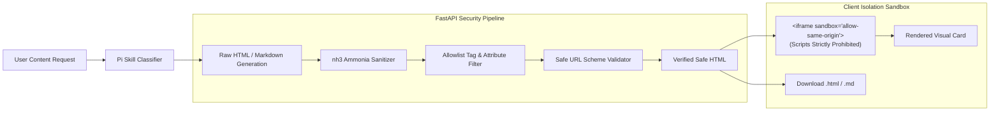

# System Architecture — The Lenny Growth Assistant

The Lenny Growth Assistant is a grounded AI platform built on top of 297 transcripts from **Lenny's Podcast**. It combines PostgreSQL Full-Text Search (FTS), a dedicated Node/TypeScript **Pi Agent**, dual LLM providers (**Google Gemini** & **Local Ollama**), and an HTML/Markdown Artifact generation engine.

---

## 1. High-Level System Architecture

---

## 2. Retrieval-Augmented Generation (RAG) Architecture

---

## 3. Artifact Generation & Security Architecture

---

## 4. Key Component Responsibilities

| Component | Technology | Primary Responsibilities |
|---|---|---|
| **Frontend** | Vanilla JS / CSS3 / HTML5 | Cinematic responsive UI, session drawer, custom dialogs, sandboxed artifact viewer, model provider switcher. |
| **FastAPI Backend** | Python 3.12 / FastAPI / SQLAlchemy | REST endpoints, database connection pooling, search query extraction, RAG orchestration, HTML sanitization, session persistence. |
| **Database** | PostgreSQL 16 (Alpine) | Full-text search over transcript chunks (`to_tsvector` GIN indexes), episode metadata, topic link mappings, session and message stores. |
| **Pi Agent** | Node.js 20 / TypeScript / Express | Agentic execution, system prompt assembly, conversational memory trimming, Ship 30 writing skill, markdown & HTML artifact generation. |
